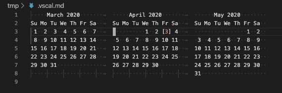

# Shows Date/Time on VSCode statusbar and Monthly Calendar upon click

Displays a clock & date information in the status bar of VSCode. 95% of the functionality comes from the awesome [upstream](https://github.com/rid9/DateTime.git),
and all I did here is just showing monthly calendar upon click or shortcut key with some highlighting for current day.
Beauty of this is you can quickly see a calendar without leaving VSCode or moving your fingers off keyboard (Ctrl+Cmd+C & Cmd-W on Mac).
Now works on Windows the same way as Mac/Linux! Enjoy!!




## Configuration Options

|Option                        |Default|Description                                        |Example       |
|------------------------------|-------|---------------------------------------------------|--------------|
|`dateTime.showOnStartup`      |`true` |Show date & time on startup.                       |              |
|`dateTime.use24HourClock`     |`true` |Use a 24 hour clock.                               |**18**:43     |
|`dateTime.showAMPM`           |`false`|Show AM/PM.                                        |7:43 **PM**   |
|`dateTime.showDayOfWeek`      |`false`|Show the day of the week.                          |**Fri** 1 Jul |
|`dateTime.showDayOfMonth`     |`false`|Show the day of the month.                         |Fri **1** Jul |
|`dateTime.showMonth`          |`false`|Show the month.                                    |Fri 1 **Jul** |
|`dateTime.showHours`          |`true` |Show hours.                                        |**18**:43     |
|`dateTime.showMinutes`        |`true` |Show minutes.                                      |18:**43**     |
|`dateTime.showSeconds`        |`false`|Show seconds.                                      |18:43:**12**  |
|`dateTime.padDays`            |`false`|Pad the day of the month with a leading 0.         |Fri **01** Jul|
|`dateTime.padHours`           |`true` |Pad hours with a leading 0.                        |**09**:43     |
|`dateTime.padMinutes`         |`true` |Pad minutes with a leading 0.                      |18:**03**     |
|`dateTime.padSeconds`         |`true` |Pad seconds with a leading 0.                      |18:43:**04**  |
|`dateTime.locale`             |`null` |Date & time locale.                                |es-us         |
|`dateTime.flashTimeSeparators`|`false`|Flash the time separators.                         |              |
|`dateTime.timeSeparator`      |`:`    |Time separator character.                          |              |
|`dateTime.timeSeparatorOff`   |` `    |Flashing time separator character.                 |              |
|`dateTime.customFormat`       |`null` |Use a custom date & time format.                   |              |
|`dateTime.clipboardFormat`    |`null` |Use a custom date & time format when copying.      |              |
|`dateTime.fractionalPrecision`|`null` |Update interval divisor for fractional seconds.    |              |
|`dateTime.statusBarAlignment` |`right`|Status bar alignment, left or right.               |left          |
|`dateTime.statusBarPriority`  |`null` |Status bar priority. Higher means more to the left.|10            |
|`dateTime.monthsBefore`        |`1`    |How many prior months to show in calendar view.    |2             |
|`dateTime.monthsAfter`         |`1`    |How many following months to show in calendar view.|10            |
|`dateTime.monthsPerRow`        |`3`    |How many months to show horizontally.              |4             |
|`dateTime.extraHorizontalSpace`|`1`    |Padding between columns in calendar view.          |              |
|`dateTime.extraVerticalSpace`  |`1`    |Padding between rows in calendar view.             |              |
|`dateTime.weekStartsOn` .      |`0`    |First day of week (0=Sun, 1=Mon) in calendar view. |              |

### Example usage

```javascript
// 28 Feb 18:47
"dateTime.showDayOfMonth": true,
"dateTime.showMonth": true

// 9:30 AM
"dateTime.use24HourClock": false,
"dateTime.showAMPM": true
```

## Custom date & time format

Custom date & time formats can be specified using the [Moment.js syntax](http://momentjs.com/docs/#/displaying/format/).

|                          |Token  |Output                                |
|--------------------------|-------|--------------------------------------|
|Month                     |`M`    |1 2 ... 11 12                         |
|                          |`Mo`   |1st 2nd ... 11th 12th                 |
|                          |`MM`   |01 02 ... 11 12                       |
|                          |`MMM`  |Jan Feb ... Nov Dec                   |
|                          |`MMMM` |January February ... November December|
|Quarter                   |`Q`    |1 2 3 4                               |
|                          |`Qo`   |1st 2nd 3rd 4th                       |
|Day of Month              |`D`    |1 2 ... 30 31                         |
|                          |`Do`   |1st 2nd ... 30th 31st                 |
|                          |`DD`   |01 02 ... 30 31                       |
|Day of Year               |`DDD`  |1 2 ... 364 365                       |
|                          |`DDDo` |1st 2nd ... 364th 365th               |
|                          |`DDDD` |001 002 ... 364 365                   |
|Day of Week               |`d`    |0 1 ... 5 6                           |
|                          |`do`   |0th 1st ... 5th 6th                   |
|                          |`dd`   |Su Mo ... Fr Sa                       |
|                          |`ddd`  |Sun Mon ... Fri Sat                   |
|                          |`dddd` |Sunday Monday ... Friday Saturday     |
|Day of Week (Locale)      |`e`    |0 1 ... 5 6                           |
|Day of Week (ISO)         |`E`    |1 2 ... 6 7                           |
|Week of Year              |`w`    |1 2 ... 52 53                         |
|                          |`wo`   |1st 2nd ... 52nd 53rd                 |
|                          |`ww`   |01 02 ... 52 53                       |
|Week of Year (ISO)        |`W`    |1 2 ... 52 53                         |
|                          |`Wo`   |1st 2nd ... 52nd 53rd                 |
|                          |`WW`   |01 02 ... 52 53                       |
|Year                      |`YY`   |70 71 ... 29 30                       |
|                          |`YYYY` |1970 1971 ... 2029 2030               |
|Week Year                 |`gg`   |70 71 ... 29 30                       |
|                          |`gggg` |1970 1971 ... 2029 2030               |
|Week Year (ISO)           |`GG`   |70 71 ... 29 30                       |
|                          |`GGGG` |1970 1971 ... 2029 2030               |
|AM/PM                     |`A`    |AM PM                                 |
|                          |`a`    |am pm                                 |
|Hour                      |`H`    |0 1 ... 22 23                         |
|                          |`HH`   |00 01 ... 22 23                       |
|                          |`h`    |1 2 ... 11 12                         |
|                          |`hh`   |01 02 ... 11 12                       |
|Minute                    |`m`    |0 1 ... 58 59                         |
|                          |`mm`   |00 01 ... 58 59                       |
|Second                    |`s`    |0 1 ... 58 59                         |
|                          |`ss`   |00 01 ... 58 59                       |
|Fractional Second         |`S`    |0 1 ... 8 9                           |
|                          |`SS`   |00 01 ... 98 99                       |
|                          |`SSS`  |000 001 ... 998 999                   |
|Unix Timestamp            |`X`    |1360013296                            |
|Unix Millisecond Timestamp|`x`    |1360013296123                         |

### Example usage

```javascript
// Friday, January 1st, 2016
"dateTime.customFormat": "dddd, MMMM Do, YYYY"

// 2016-01-01 10:12:03
"dateTime.customFormat": "YYYY-MM-DD HH:mm:ss"
```

## Release Notes

### v1.4.3
Pull and merge latest from rid9
### v1.4.1
Starts reading day & month names from system 'default', hoping this helps non-English (untested :wink:)

### v1.4.0
Support for Monday as first day of week

### v1.3.1
A little updates to README and the extension name, celebrating 100+ installs! :tada:

### v1.3.0
Windows support, along with finer grained calendar view customization. :star2: BIG thanks to @[tice-k](https://github.com/tice-k)! :+1:

### v1.2.0
New hand-designed icon, while trying to sync the version# with [Marketplace](https://marketplace.visualstudio.com/items?itemName=miyamotoh.vscal2)...

### v0.5.0 (=v1.1.0 on VSCode Marketplace)
Still Mac/Linux only, but now installable (by following [this page](https://code.visualstudio.com/api/working-with-extensions/publishing-extension)), along with highlighting the current month in calendar view.

### v0.2.0
Still Mac/Linux only, and still not installable, but added `dateTime.calendarMonths` config param for customizing how many months to show in calendar view.

### v0.1.0
Not even a "release," just adjusted it to ES6 and locally installed (by copying `package.json` and `out` to `$HOME/.vscode/extensions/miyamotoh-vscal2-0.1.0` dir) but works.. :blush:
